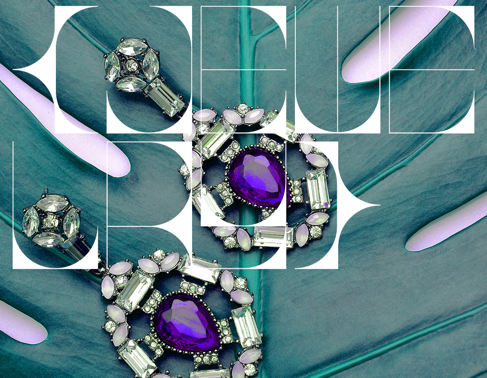
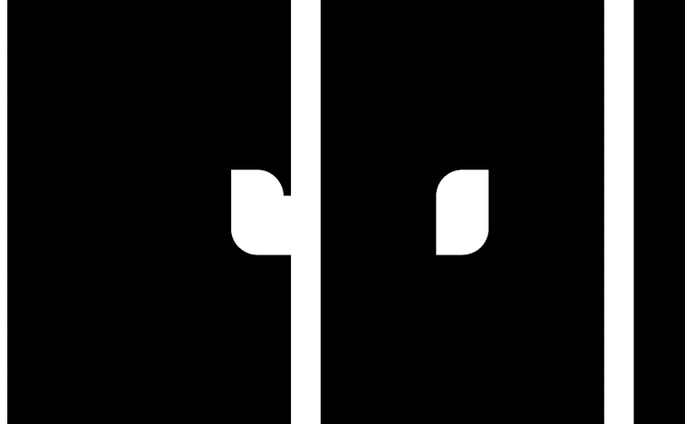
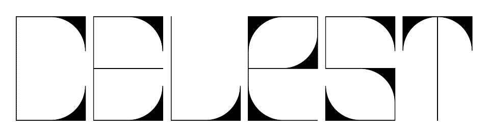
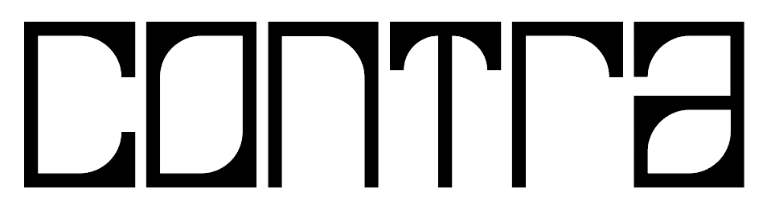
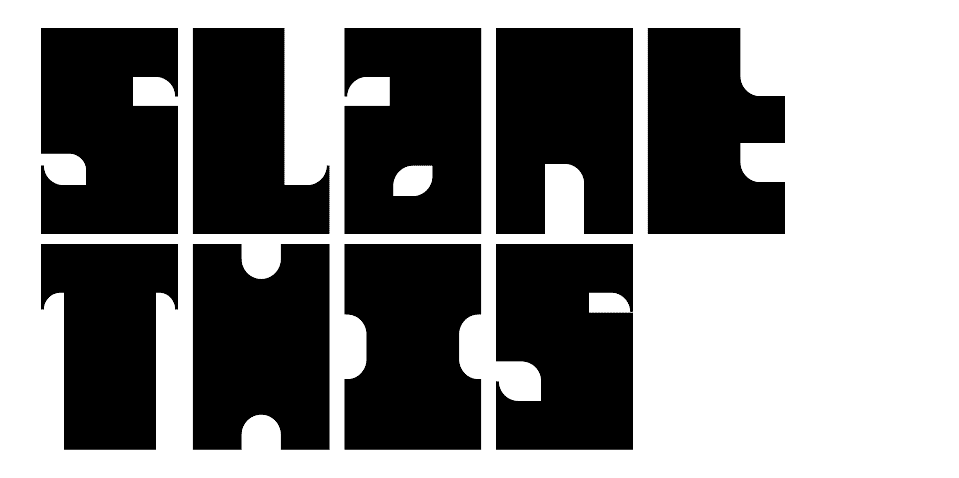

# 01.typeKINI

中文简介请先前往[这里](https://mp.weixin.qq.com/s/LMMyMxodzIC0UZkd4ybbkA)

0.1typeKINI is a open source monospaced variable font for graphic design, originally made for sharp, high-contrast metal jewelry, now expanded from single-weight to variable.

## Axes
### weight 4-120-460

### contrast 0-120

### slant(In Progress) 0-60

## OpenType Features
### Style Sets
#### SS01 Normal Space for simulating body text
#### SS02 "Humanist" More "humanistic" glyphs
#### SS03 Fierce glyphs
#### SS04-SS10 Alternative glyphs

## Main Glyphs
### weight 8

### weight 308
